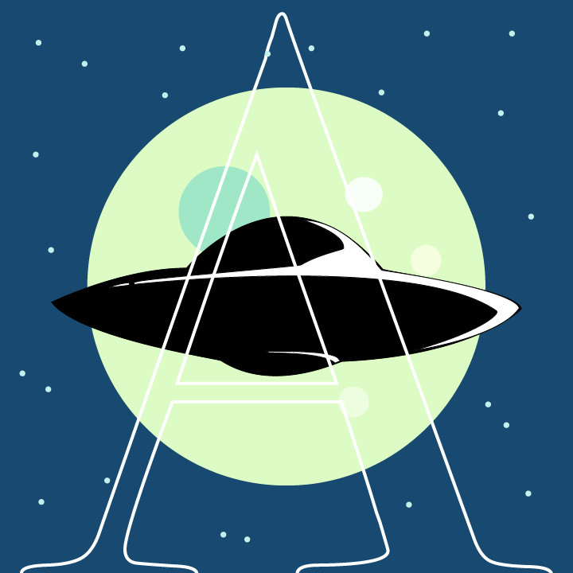
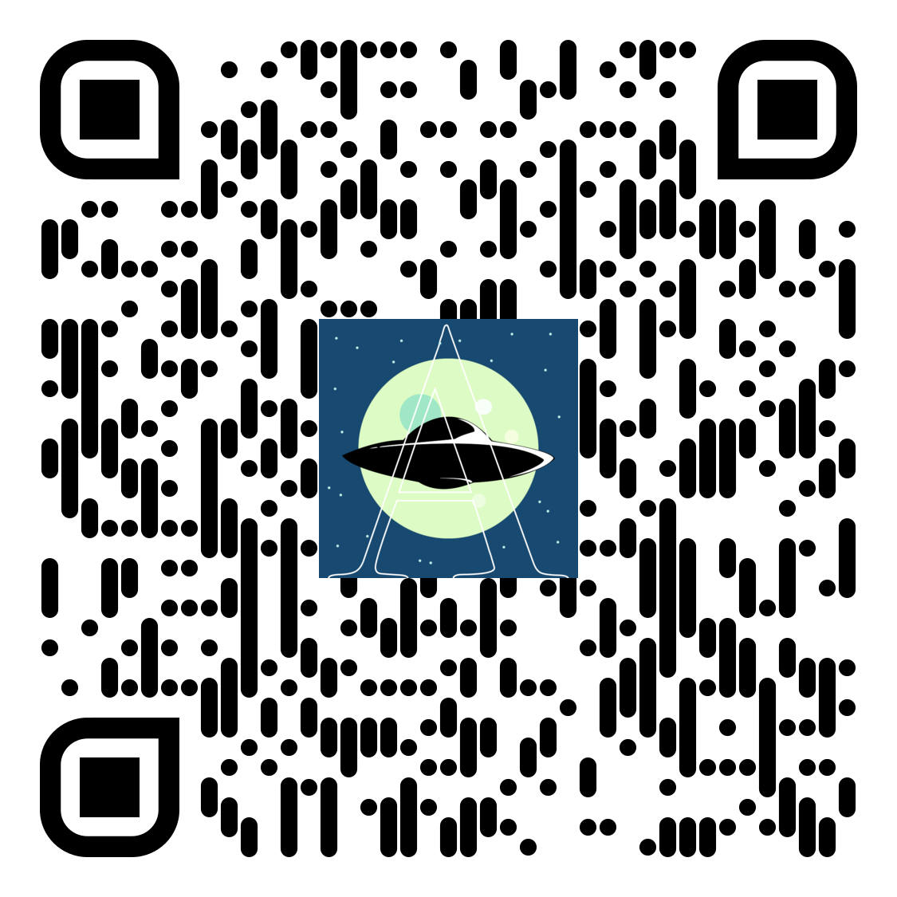

Gruppe-4 - AmongAlien V2.0
---------------------------------------------------------------------
---------------------------------------------------------------------

 

 
 

---------------------------------------------------------------------

## Spielentwickler

---------------------------------------------------------------------

Hamza Zarah, Joel Erbsland und Rayes Diyab

---------------------------------------------------------------------

## Speilbeschriebung

---------------------------------------------------------------------
Aliens wollten die Erde von den Menschen befreien. Die letzten 
menschlichen Bewohner schlagen ihr Lager auf, doch die Alien sind 
bereits unter ihnen. Ziel der Menschen ist es, das Lager zu einem 
Alienicheren Dorf zu erweitern oder alle Aliens wegzusperren.
Ziel der Aliens ist es, alle Menschen abzusaugen und nicht erkannt 
zu werden. 
Das AmongAlien V2.0 Spiel ist ein nicht rundenbasiertes Spiel. Es
ist ein Spiel mit einer 2D Grafik, bei dem das Spiel laufend 
aktualisiert wird. Gefragt ist eine gute Teamfähigkeit aber auch 
eine gute Überzeugungskraft.

Viel Spass!

---------------------------------------------------------------------

<h2>Inventar:</h2>
<i>Beerenbusch:</i> Füllt Hunger auf und wird für Tasks benötigt. 
<i>Erdbeere:</i> Füllt Hunger auf und wird für Tasks benötigt. 
<i>Fisch:</i> Erhält man durch Angeln. Füllt Hunger auf. 
<i>Holz:</i> Wird für Tasks benötigt. 
<i>Lehm:</i> Wird für Tasks benötigt. 
<i>Stein:</i> Wird für Tasks benötigt.
  

---------------------------------------------------------------------

<h2>Steuerung:</h2>
<i>W, A, S, D:</i> bewegen 
<i>E:</i> Task abschliessen 
<i>T:</i> Task abfragen / Materialien aufnehmen 
<i>Mark-Button:</i> Menschen markieren, welche im Radius des Aliens sind  

---------------------------------------------------------------------

<h3>Handbuch:</h3><a href="https://drive.google.com/file/d/1sqRbt3Onv5nQCZ1Tzi-AMpiaSjEbkSCU/view?usp=sharing">AmongAlien Manual.pdf</a>

--------------------------------------------------------------------

<h3>Website:</h3>
<a href="https://diyabrayes.wixsite.com/among-alien-2-0">Among Alien Website</a>

  
 

--------------------------------------------------------------------

## Anhang

<h2>Zu grosse Daten</h2>
In den Ordnern Milestone2, Milestone 5, outreach und src\main\resources
muss man grössere Video Dateien downloaden, welche fuer Github zu gross sind.
Klicken SIe bitte auf die .txt Datei und laden Sie die .mp4 Dateien von Google Drive runter
